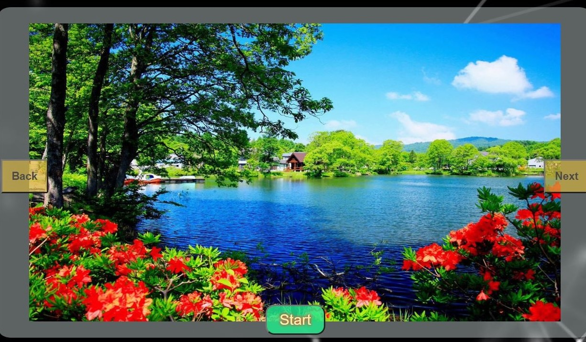

# Voice-Slider
</img> 
</img>
 
<b>Make your website standout by using sliders that can also be Controlled by your Voice!</b>

<b>Website-Demo : <a href="https://somoy73.github.io/Voice-Slider/">Voice Slider</a></b>

</img>
 
Simply, Click on the Start button and speak out aloud from one of the Commands below!
 
<b>
Available List of Commands:
- Say "Next" to move to the next image of the slider.
- Say "Previous" or "Back" to move to  the previous image of the slider.
- Say "First" or "Last" to jump to the first or last image of the slider.
- Say "Stop" to stop the voice recognition!
</b>
Feel free to edit the code and add your own commands! Have fun!

P.S: Mozilla and Safari are not supported for now. However, this will work just fine in Chrome, Edge and Samsung Browser.
Try Chrome for best Experience

